# Solar Inverter Anomaly Detection

Unsupervised anomaly detection for solar PV inverters using Isolation Forest. Built on Plant 1 data from the [Solar Power Generation Dataset](https://www.kaggle.com/datasets/anikannal/solar-power-generation-data) (Kaggle).

---

## Problem Statement

Solar PV plants generate large volumes of 15-minute interval data across multiple inverters. Identifying underperforming or anomalous inverters manually is impractical at scale. This project builds an unsupervised anomaly detection pipeline that flags inverter readings deviating from expected behavior — accounting for irradiation conditions, temperature effects, and time-of-day context.

---

## Project Structure

```
solar-anomaly-detection/
│
├── notebooks/
│   └── phase1_analysis.ipynb       # Full EDA, feature engineering, and model development
│
├── api/
│   ├── main.py                     # FastAPI application
│   ├── model_utils.py              # Feature engineering logic (shared by training and API)
│   └── train_and_save.py           # Train and serialize model artifacts
│
├── models/                         # Generated after running train_and_save.py
│   ├── isolation_forest_v2.pkl
│   └── scaler_v2.pkl
│
├── images/                         # All output plots
├── requirements.txt
├── DEPLOYMENT.md                   # FastAPI deployment guide
└── README.md
```

---

## Dataset

| File | Description |
|---|---|
| `Plant_1_Generation_data.csv` | 15-min DC/AC power and daily/total yield per inverter |
| `Plant_1_Weather_Sensor_Data.csv` | Ambient temperature, module temperature, irradiation |

- **Merged on:** `DATE_TIME` + `PLANT_ID`
- **Scope:** Plant 1, May–June 2020, 22 inverters
- **Filtered to:** Daylight hours only (`DC_POWER > 0` and `IRRADIATION > 0`)

---

## Feature Engineering

| Feature | Formula | Rationale |
|---|---|---|
| `EFFICIENCY_RATIO` | `AC_POWER / DC_POWER` | Captures inverter conversion loss |
| `IRR_NORM_DC` | `DC_POWER / IRRADIATION` | Removes irradiation effect from DC output |
| `TEMP_DERATING` | `(EXPECTED_DC − DC_POWER) / P_RATED × 100` | Quantifies power loss due to temperature above 25°C |
| `ROLLING_DEVIATION` | `DC_POWER − 1hr rolling mean` | Flags intra-day instability vs inverter's own baseline |
| `HOUR_SIN` / `HOUR_COS` | Cyclic encoding of hour | Prevents peak-hour false flags by giving the model time context |

**Temperature derating** uses a 0.5%/°C coefficient (standard for crystalline silicon) and estimates `P_RATED` per inverter as the 95th percentile DC output during the top 10% irradiation conditions.

---

## Methodology

### 1. Exploratory Data Analysis

**Efficiency Ratio per Inverter**
Fleet efficiency is tightly clustered between 0.975–0.980. Outliers above 1.0 indicate sensor artifacts at very low DC values near sunrise/sunset.

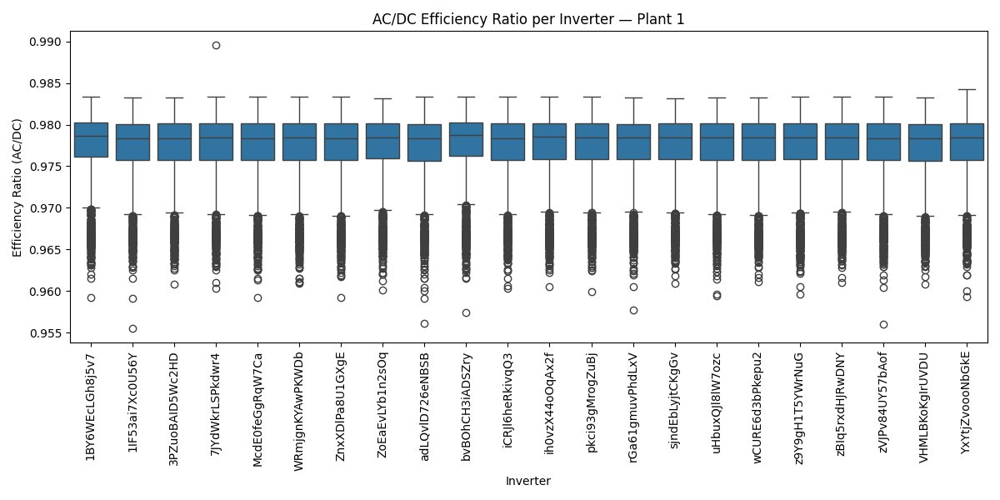

**DC Power vs Irradiation**
Strong positive linear relationship confirms irradiation is the primary driver of DC output. Scatter at mid-irradiation values points to inverter-level variability worth investigating.

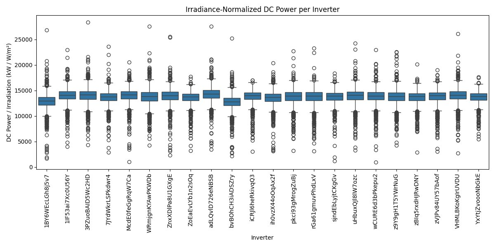

**Fleet Average Efficiency Over Time**
Daily mean efficiency fluctuates within a narrow band (~0.9758–0.9783) with no long-term degradation trend over the 35-day window.

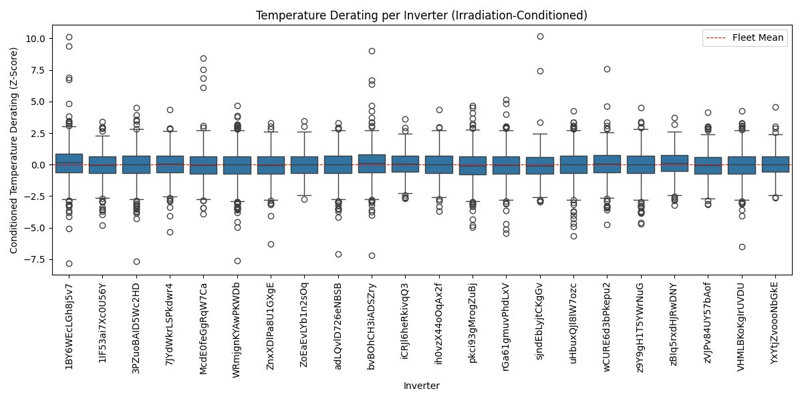

**Inverter Efficiency Ranking**
Bottom-quartile inverters (red) are flagged for monitoring. Differences are small in absolute terms but consistent across days — indicating systematic rather than random underperformance.

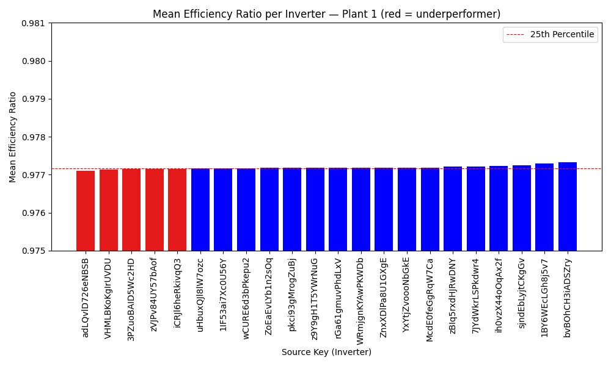

**Module Temperature vs Efficiency**
Efficiency stabilizes above ~30°C, consistent with expected thermal behavior in crystalline silicon modules.

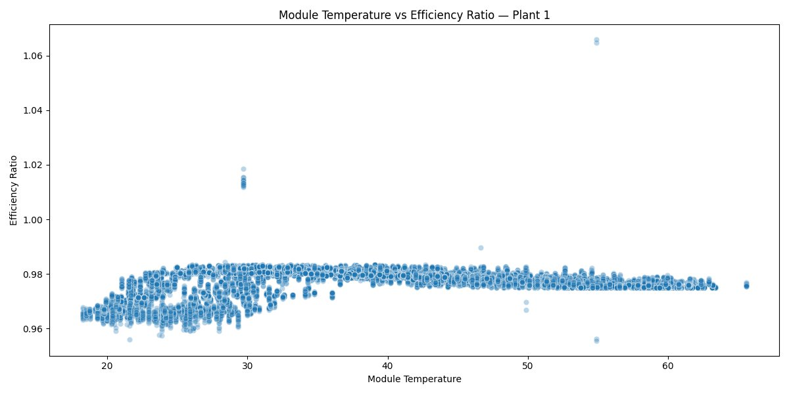

---

### 2. Feature Engineering Plots

**Irradiance-Normalized DC Power per Inverter**
After normalizing by irradiation, inter-inverter differences become more visible — isolating panel and inverter performance from weather.

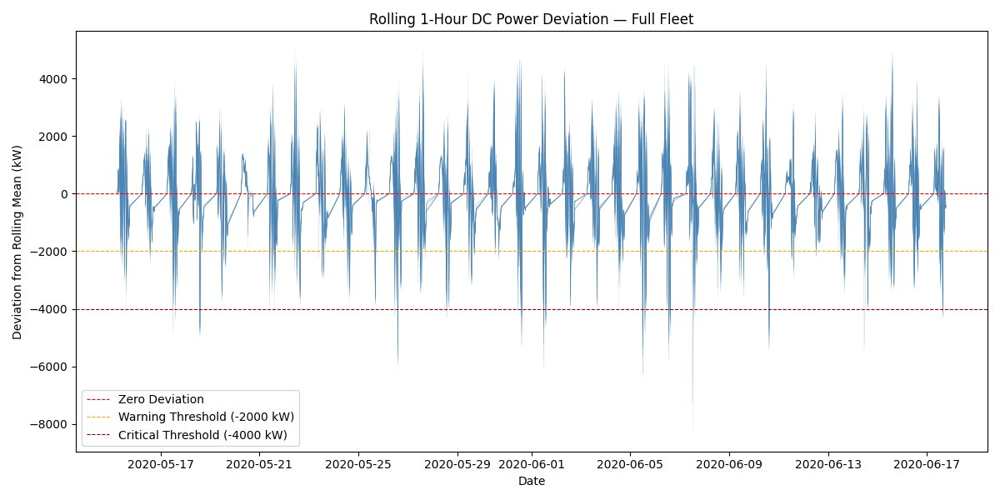

**Temperature Derating per Inverter (Irradiation-Conditioned)**
Derating scores are standardized within irradiation bins to remove the confounding weather effect. Values near zero indicate performance close to the fleet mean.

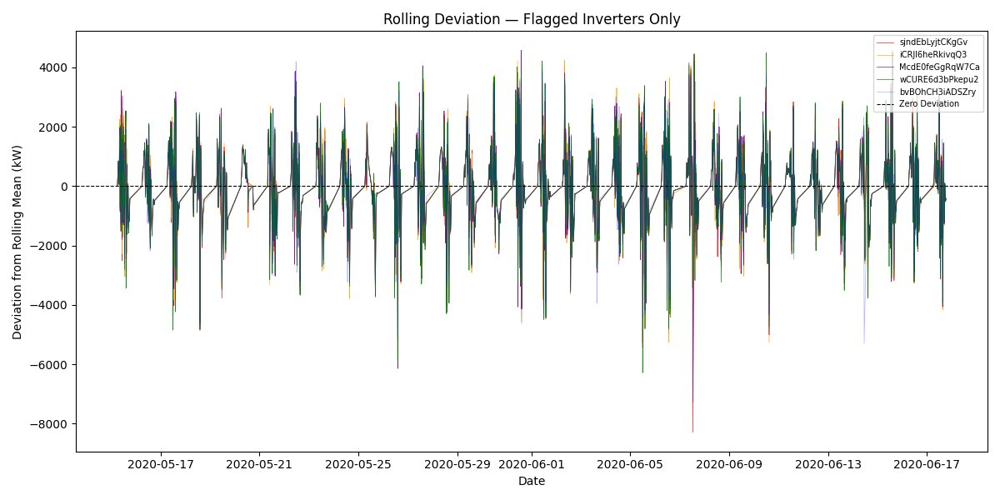

---

### 3. Baseline — Statistical Threshold Method

A per-inverter, per-hour 2σ threshold on `EFFICIENCY_RATIO` was used as the baseline anomaly detector.

- **Fleet average flag rate:** 1.57%
- **Flag rate range across inverters:** ~1.37% – 1.73%

The baseline is used as a comparison reference — not ground truth, since no labeled fault data exists.

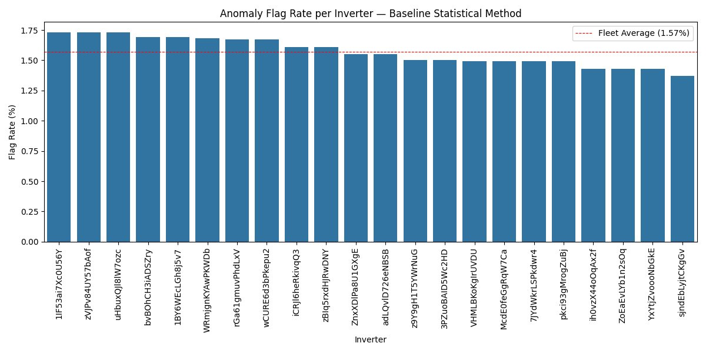

---

### 4. Model 1 V1 — Isolation Forest (Initial)

**Features:** `DC_POWER`, `EFFICIENCY_RATIO`, `TEMP_DERATING`, `IRRADIATION`

Contamination set to **0.0157** to match the baseline fleet flag rate for a fair comparison.

**V1 Flag Rate per Inverter**

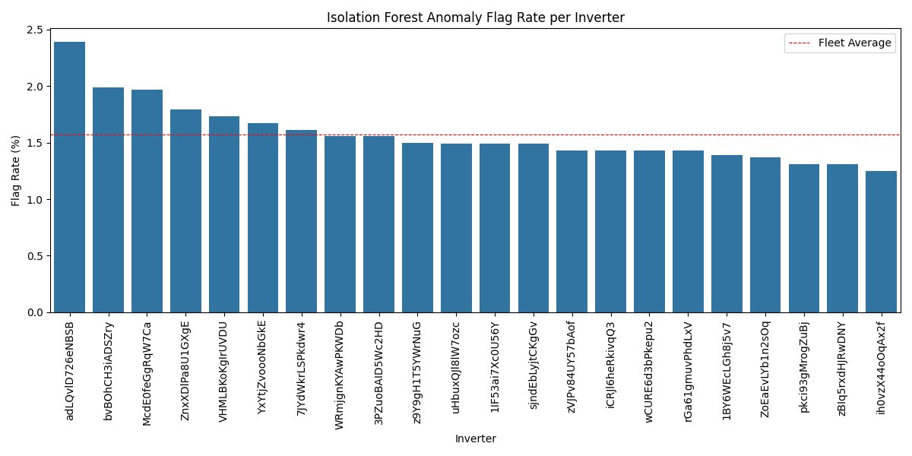

**V1 Anomalies on DC Power — Flagged Inverters**

V1 anomalies concentrate at peak irradiation hours — a known bias caused by including raw `DC_POWER` and `IRRADIATION` as features. High-power peaks are isolated by the forest, but they represent normal operating points, not faults.

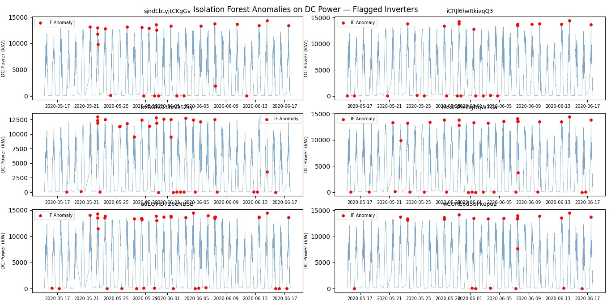

---

### 5. Model 1 V2 — Isolation Forest (Improved)

**Motivation:** V1's peak-hour bias was confirmed diagnostically — the mean irradiation during flagged anomalies was significantly above the fleet mean, confirming the model was flagging normal peak-production readings.

**Changes from V1 to V2:**

| Change | Reason |
|---|---|
| Removed `DC_POWER`, `IRRADIATION` | Highly correlated — causes peak-hour bias |
| Added `IRR_NORM_DC` | Cleaner signal after removing irradiation effect |
| Added `ROLLING_DEVIATION` | Captures intra-day instability vs inverter's own baseline |
| Added `HOUR_SIN` + `HOUR_COS` | Cyclic time encoding prevents time-of-day false flags |

**Final V2 features:** `EFFICIENCY_RATIO`, `IRR_NORM_DC`, `TEMP_DERATING`, `ROLLING_DEVIATION`, `HOUR_SIN`, `HOUR_COS`

**V2 vs V1 Diagnostic Result:**
- V1 anomaly mean irradiation → significantly above fleet mean (peak-hour bias confirmed)
- V2 anomaly mean irradiation → closer to fleet mean (bias reduced)

**V2 Flag Rate per Inverter**

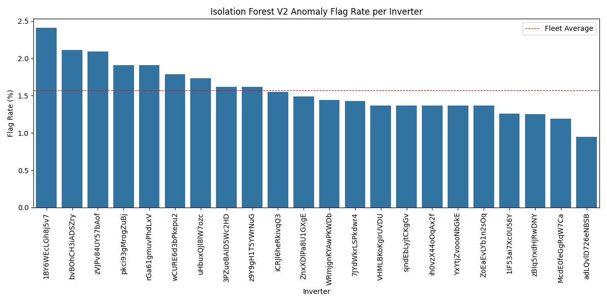

**V2 Anomalies on DC Power — Flagged Inverters**

V2 anomalies shift to near-zero DC readings — consistent with actual fault signatures such as inverter shutdowns and ramp-up/ramp-down irregularities rather than normal peak production.

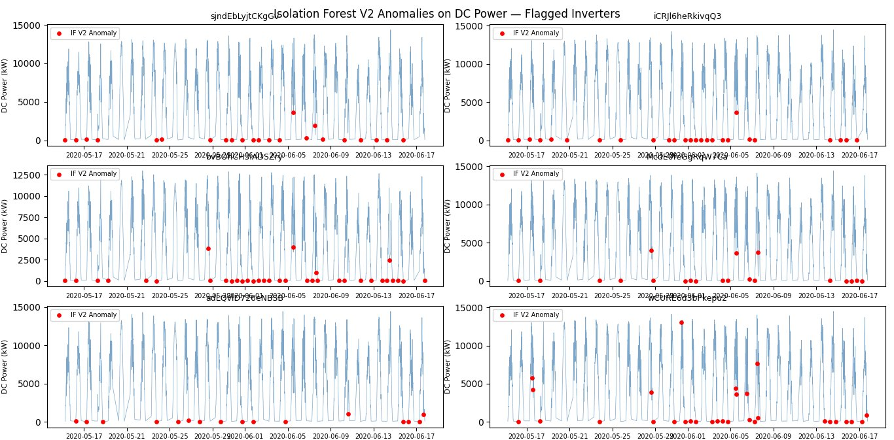

---

### 6. Dedicated Inverter Analysis — `sjndEbLyjtCKgGv`

A flagged inverter was selected for deeper time-series analysis to validate model behavior at the individual level.

**Daily IRR_NORM_DC vs Fleet Average**
The target inverter tracks the fleet closely on most days, with divergences in mid-May and early June.

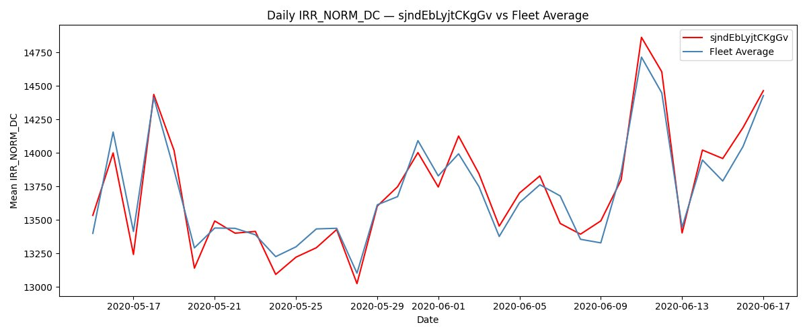

**Relative Performance vs Fleet (with Trend)**
Trend slope: **+0.0323% per day** — indicating the inverter was gradually recovering relative to the fleet. It never crossed the −5% warning or −10% critical thresholds over the observation window.

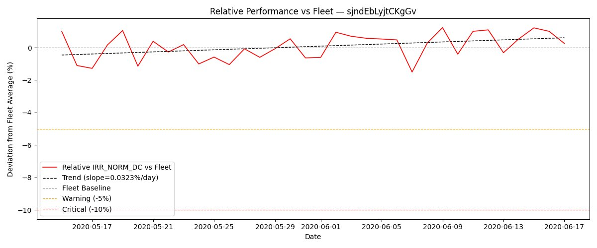

**Multi-Metric Relative Performance**
Relative DC power shows a notable dip (~−8%) around 2020-06-07, while IRR_NORM_DC and efficiency remain near fleet baseline — suggesting a brief output event not fully explained by irradiation or conversion loss.

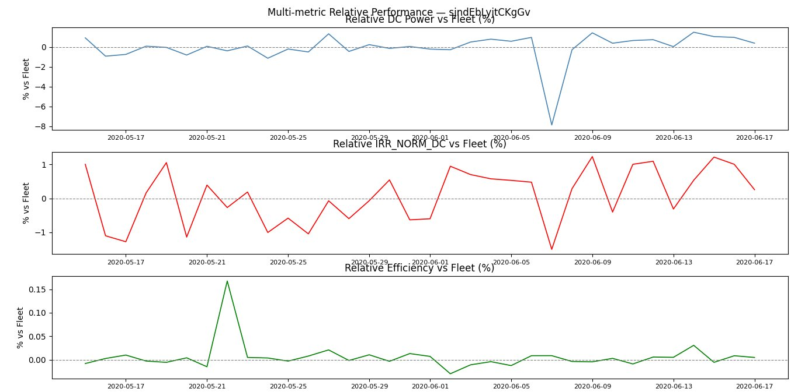

---

## Model Comparison Summary

| Method | Features | Known Issue | Anomaly Pattern |
|---|---|---|---|
| Baseline (2σ) | `EFFICIENCY_RATIO` per hour bucket | Assumes normality | Hour-bucket deviations |
| IF V1 | DC, efficiency, derating, irradiation | Peak-hour bias | Flags high-irradiation peaks |
| **IF V2 ✓** | efficiency, IRR_NORM, derating, rolling deviation, time | None identified | Near-zero readings, true shutdowns |

**V2 is the recommended model.** It produces anomaly flags consistent with expected fault signatures and reduced sensitivity to normal peak-production behavior.

---

## Limitations

- **No ground truth labels.** This is unsupervised — agreement with the statistical baseline is used as a proxy for validation.
- **Single plant.** All results are from Plant 1 only. Generalization to other plants or sensor setups has not been tested.
- **Short observation window.** ~35 days limits trend reliability and seasonal generalization.
- **Contamination is assumed.** The 1.57% rate is set to match the baseline, not derived from domain knowledge of actual fault frequency.
- **`P_RATED` is estimated.** Rated power is approximated from historical high-irradiation data, not manufacturer specifications.

---

## Deployment

See [`DEPLOYMENT.md`](DEPLOYMENT.md) for step-by-step instructions to run the FastAPI inference service locally.

---

## Requirements

Install all dependencies:

```bash
pip install -r requirements.txt
```

---

## Author

**John Paul T. Villaban**
Registered Electrical Engineer (REE) — Philippines
[GitHub](https://github.com/) | [Kaggle](https://www.kaggle.com/)
